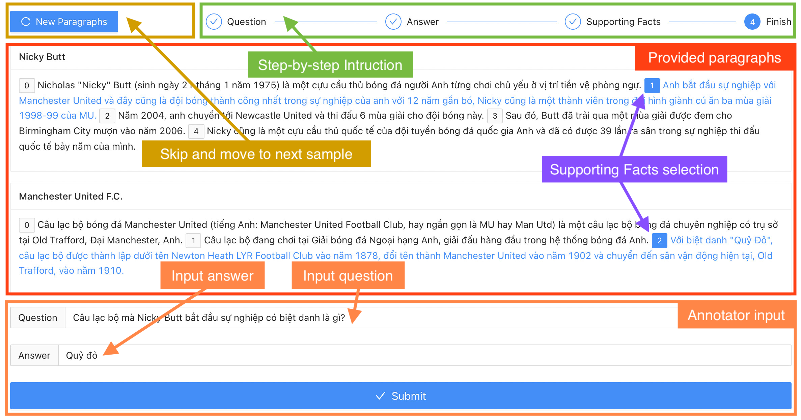

# Multilingual Multi-hop Question-Answering Dataset Maker

A tool for creating multilingual multi-hop Question-Answering datasets. This project uses MySQL and
Java Spring.



## Requirements

- Java 11
- Maven
- MySQL

## Installation

After cloning this repository, you need to setup MySQL database and configure it
in `application.yml`

```yaml
spring:
  datasource:
    driver-class-name: com.mysql.cj.jdbc.Driver
    username: <mysql username>
    password: <mysql password>
    url: <mysql connection string>
```

Specify the Wiki language code. This will be the language of the dataset. Use the code listed by
Wikipedia. For example: English(en), Vietnamese(vi).

```yaml
application:
  wiki-language-code: vi
```

Package the code with the following command.

```shell
mvn package
```

Start the application with the following command.

```shell
java -jar target/*.jar
```

The tool is now accessible via `localhost:8080`


